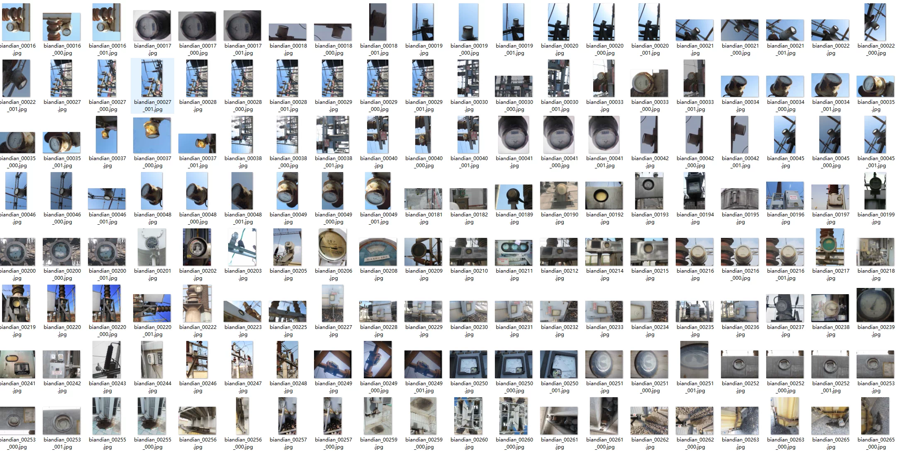
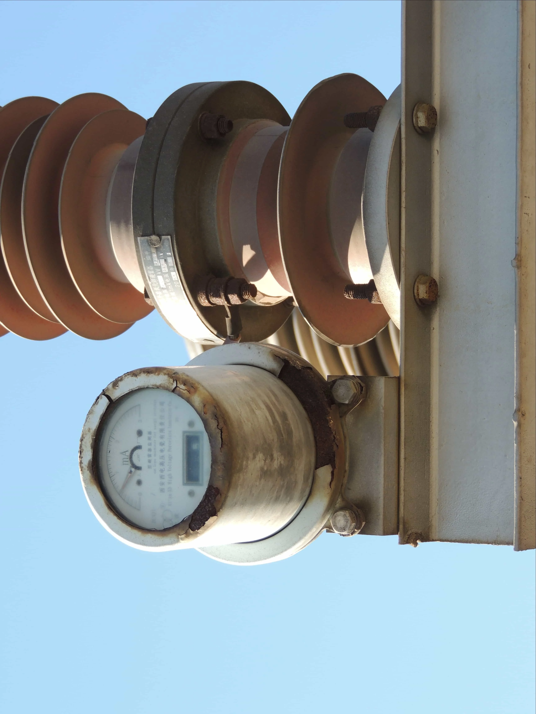
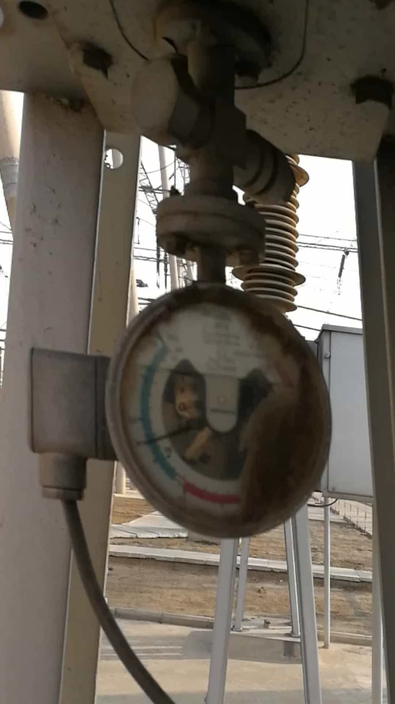
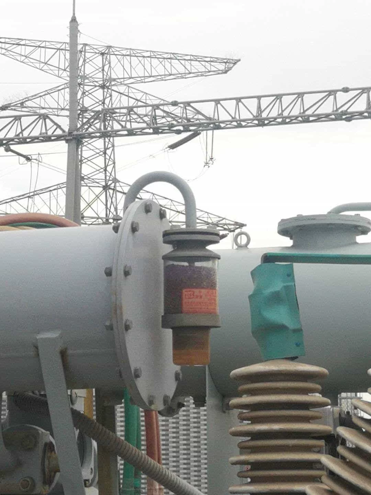
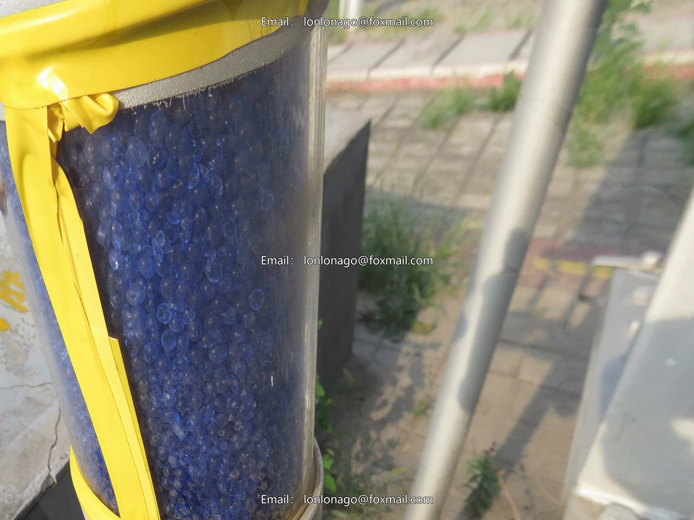
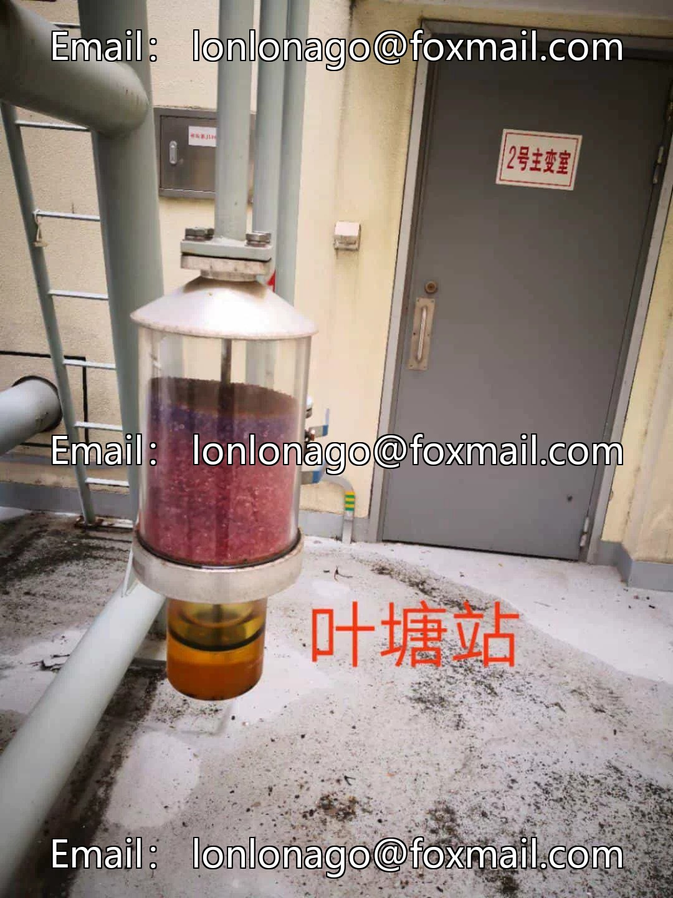
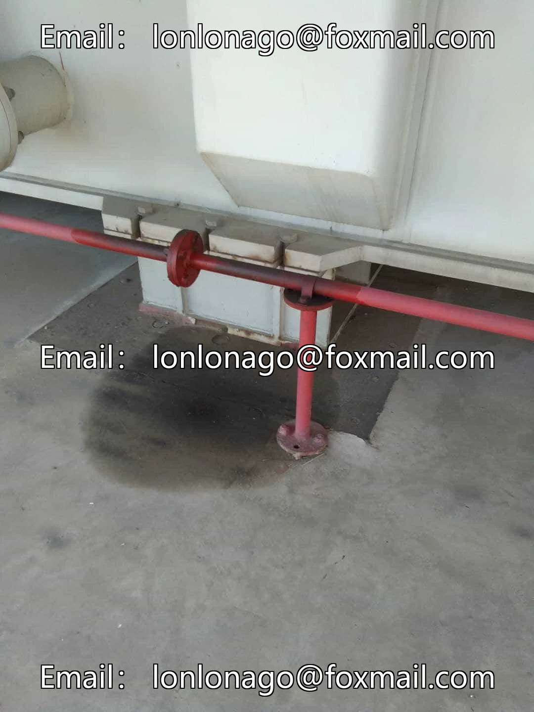

## Body

Substation Equipment Defect Detection Dataset (Metering Instruments, Silicone Breathers) YOLO Format

This dataset primarily targets the detection of defects in high-frequency maintenance components of substations, such as oil level meters and silicone breathers.

Dataset split: Training set consists of 4389 images without further segmentation.

The categories for annotation are divided into six types: blurred instrument panels, rusted instrument housings, rusted instrument housings, discolored silicone rubber of the breather, and damaged breather silicone cover.

A detailed source document is included with the dataset.

Electronic virtual products are not returnable upon sale.

## Images

Here is a pay link on Stripe ( https://buy.stripe.com/3cs8yP7sY87d0vu9AB ). Please contact me lonlonago@foxmail.com after funding $89, and I will send you a complete data files , thank you!

